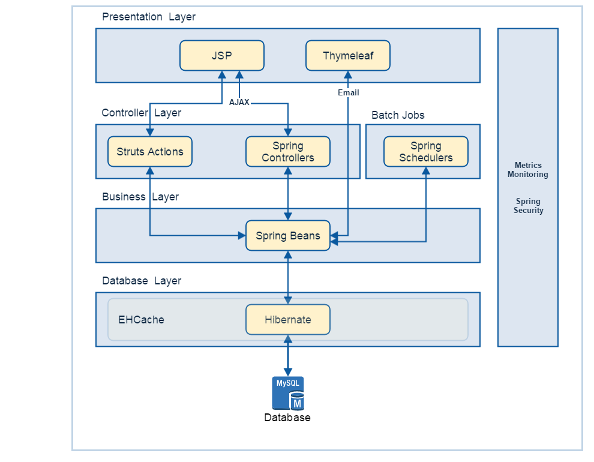

# Introduction for Leave Management System

## Steps to do to configure the application

1. Create a database in mysql named tryzens_portal with username as root and password as root
2. Add the application to Tomcat 6+ server
3. Start the server. Monitor if any errors appearing
4. Hit application to see if login page is appearing - http://localhost:8080/portal-lms/

# Sample Login data

Admin Role
admin@localhost.com/admin

Manager Role
manager@localhost.com/manager

User Role
user@localhost.com/user

# Technology Stack

| Framework | Version |
| -------- | -------- |
| Spring   | 3.1.0.RELEASE  |
| Struts | 1.2.9 |
| Hibernate | 3.6.10.Final |
| Thymleaf | 2.1.4.RELEASE |
| EHCache | 2.4.3 |
| JODA Time | 2.4 |
| Metrics | 3.0.2 |
| PDF Box | 1.8.7 |
| Apache POI | 3.10.1 |

# Application Architecture

